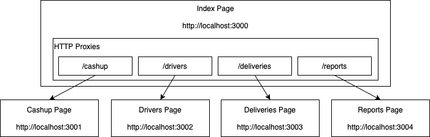

# Simple Micro Front End

This is an experiment using NodeJS and Express to split a front end up into independently deployable units. It is about as simple as I can make it. It consists of an index page and four other pages: cashup, deliveries, drivers, reports. Each of these pages is a separate Express project which would run its own Express server, be stored in its own git repository, potentially be owned by a separate team and deployed independently. The index page project uses an HTTP proxy module to proxy requests through to the servers running the other pages. So from the users point of view it feels like one website.

